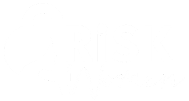

  

<h1 align="center">
  

  
  
  

Pilar de Equidade Racial — Risk Women
</h1>

Mapeamento estratégico de mulheres negras no mercado de riscos

---

  <a href="./perguntas.md">Perguntas</a> •
  <a href="./metodologia.md">Metodologia</a> •
  <a href="./roadmap.md">Roadmap</a>

---

# Pilar de Equidade Racial — Risk Women

## Contexto Estratégico

Este repositório documenta a estrutura inicial de onboarding do pilar de equidade racial da Risk Women (RW).

O objetivo do onboarding é mapear, de forma estruturada, quem são as mulheres pretas da comunidade RW, seus momentos de carreira, desafios e objetivos profissionais.

Mais do que um cadastro, este onboarding funciona como uma base estratégica para direcionar ações futuras do pilar.

---

## Direcionamento do Pilar

A proposta do pilar é fortalecer o crescimento de carreira de mulheres pretas dentro do mercado de risco, atuando de forma estruturada sobre barreiras relacionadas a acesso, visibilidade, networking e oportunidades.

---

## Objetivo do Onboarding

O onboarding foi desenvolvido para:

- compreender o perfil atual da comunidade
- identificar barreiras recorrentes
- segmentar diferentes momentos de carreira
- direcionar futuras iniciativas
- gerar base de inteligência para decisões do pilar

---

## Estrutura do Onboarding

O onboarding foi dividido em:

1. Identificação e contexto profissional
2. Momento de carreira
3. Barreiras e acesso
4. Objetivos profissionais
5. Interesse em iniciativas da RW

---

## Próximos passos

A partir da consolidação das respostas, os próximos movimentos incluem:

- análise da base
- identificação de padrões
- definição de prioridades
- estruturação das primeiras iniciativas direcionadas

---

## Premissas da Construção

A estrutura do onboarding parte das seguintes premissas:

- crescimento de carreira exige direcionamento estruturado
- mulheres negras não representam um grupo homogêneo em termos de trajetória profissional
- ações efetivas dependem de compreensão aprofundada da comunidade
- dados devem orientar priorização e tomada de decisão
- pertencimento deve funcionar como alavanca para desenvolvimento profissional

---

## Status

Versão inicial em construção.
